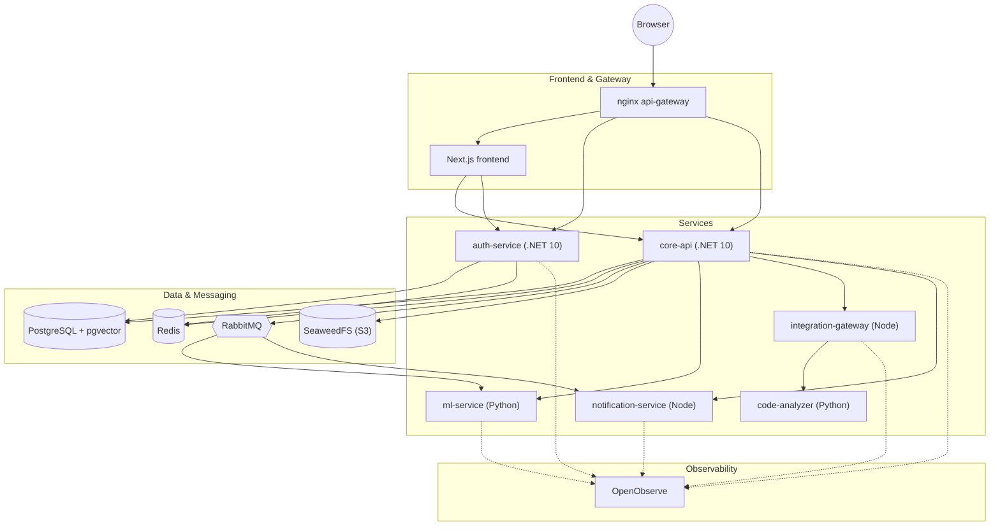

# DevHunt

A hackathon platform — teams, projects, task boards, real-time chat, an AI project-planning
assistant, and GitHub/GitLab integrations — built as a polyglot microservices system.

[](https://scanaislop.com)
[](https://github.com/YanchikFox/DevHunt/actions/workflows/ci.yml)
[](LICENSE)
[](DevHunt.CoreApi)
[](frontend)
[](frontend)
[](ml-service)

## What this is

DevHunt lets hackathon organizers and teams manage the whole event lifecycle: forming
teams, publishing and joining projects, running a kanban task board, chatting in
real time, and syncing work with GitHub/GitLab issues. An ML service backs an
AI assistant that helps plan projects and generate recommendations, and a
showcase view lets teams present finished work.

This is a public, squashed snapshot of a private working repository — see
[Development history](#development-history) below for what that means in practice.

## Why it's interesting

- **Polyglot microservices** — 6 independently deployable services: two ASP.NET
  Core (.NET 10) APIs (`auth-service`, `core-api`), two Python services (`ml-service`
  FastAPI, `code-analyzer`), and two Node/Express services (`notification-service`,
  `integration-gateway`), fronted by a Next.js app and an nginx gateway.
- **Event-driven backbone** — services communicate over a RabbitMQ topic exchange
  (`devhunt.events`) instead of point-to-point calls where possible, so notification,
  ML, and integration workflows react to domain events asynchronously.
- **Full observability** — every service is instrumented with OpenTelemetry and
  ships traces, logs, and metrics into a single OpenObserve backend (no separate
  Prometheus/Grafana/Jaeger/OpenSearch stack to run).
- **A homegrown static analyzer** — `DevHunt.Analyzer` is a purpose-built Python
  service (tree-sitter + Semgrep, ~480 rules) that clones and scans repositories
  on demand, used by the integration layer rather than pulled off the shelf.
- **17 CI/CD workflows** — beyond standard build/test/lint, the pipeline runs
  mutation testing, contract testing, visual regression testing, performance
  checks, and five separate security scanners (Semgrep, Trivy, Hadolint,
  IaC/Checkov, dependency scanning) — see [Testing & quality](#testing--quality).
- **Production compose is hardened, not decorative** — `docker-compose.prod.yml`
  applies `cap_drop: ALL`, `read_only` root filesystems, `no-new-privileges`,
  and requires every secret via environment variables with no insecure defaults.

## Architecture



`core-api` is the hub: it owns the domain data in PostgreSQL, publishes/consumes
events on RabbitMQ, stores files in SeaweedFS, and calls out to `ml-service`,
`integration-gateway`, and `notification-service` over HTTP. `auth-service` owns
JWT issuance, OAuth (GitHub/Google), and TOTP 2FA independently.

## Repository structure

| Path | What it is |
|---|---|
| `DevHunt.CoreApi/` | Main backend — ASP.NET Core (.NET 10), REST API + SignalR |
| `DevHunt.AuthService/` | Authentication — JWT, OAuth, TOTP |
| `DevHunt.Infrastructure/` | Shared EF Core — `DbContext`, models, migrations |
| `DevHunt.DatabaseMigrator/` | One-shot DB migrator (runs on stack startup) |
| `DevHunt.DatabaseSeeder/` | Manual test-data seeder (dev only, not deployed) |
| `DevHunt.Analyzer/` | Static code analyzer (Python, tree-sitter + Semgrep) |
| `DevHunt.CoreApi.Tests/`, `DevHunt.AuthService.Tests/` | xUnit test suites |
| `tests/` | Cross-cutting tests: architecture rules, contract tests, performance |
| `frontend/` | Next.js 16 App Router client |
| `ml-service/` | FastAPI — AI assistant, recommendations (Groq/Gemini) |
| `notification-service/` | Express 5 — email/SMS/push notifications |
| `integration-gateway/` | Express 5 — GitHub/GitLab OAuth and webhooks |
| `nginx/` | API gateway — single entry point, TLS, rate limiting |
| `monitoring/` | OpenObserve configuration |
| `seaweedfs/` | S3-compatible file storage config |
| `infrastructure/` | DB init scripts |
| `packages/` | Shared Node libraries (e.g. `throttle` backpressure helper) |
| `k8s/` | Early-stage Kubernetes manifests — see [`k8s/README.md`](k8s/README.md) |
| `documentation/` | Docusaurus documentation portal |
| `scripts/` | Dev/prod startup, backup, and CI helper scripts |
| `memory/` | Internal knowledge base used by AI coding assistants |

## Quick start

```bash
cp docker-compose.override.yml.example docker-compose.override.yml
# fill in secrets (POSTGRES_PASSWORD, JWT_KEY, etc.)
docker compose up
```

Run a single service instead of the whole stack:

```bash
docker compose up <service-name>
# e.g.: docker compose up core-api
```

Each service also has its own `README.md` with service-specific run instructions.

### Service URLs

| Service | URL |
|---|---|
| Frontend | http://localhost:3000 |
| API Gateway (nginx) | http://localhost |
| Core API + Swagger | http://localhost:7002/swagger |
| Auth Service | http://localhost:7001 |
| RabbitMQ management | http://localhost:15672 |
| OpenObserve (traces/logs/metrics) | http://localhost:5080 |

### Monitoring stack only

```bash
docker compose -f docker-compose.monitoring.yml up -d
# OpenObserve: http://localhost:5080
```

## Testing & quality

```bash
dotnet test                          # .NET unit + integration (xUnit)
cd frontend && npm test              # Vitest unit tests
cd frontend && npm run test:e2e      # Playwright end-to-end tests
cd frontend && npm run storybook     # Component catalog (Storybook)
```

CI/CD is split across 17 GitHub Actions workflows — full details, triggers, and
required secrets are in [`.github/ACTIONS.md`](.github/ACTIONS.md). Categories:

- **Build & code quality:** `ci.yml`, `pr-checks.yml`, `architecture.yml`
  (dependency-cruiser/madge for JS/TS, NetArchTest for .NET), `sonarqube.yml`,
  `aislop.yml`, `powershell-lint.yml`
- **Security scanning:** `semgrep.yml` (SAST), `trivy.yml` (containers/deps),
  `hadolint.yml` (Dockerfile lint), `iac-security.yml` (Checkov/KICS), `depscan.yml`
- **Test depth:** `contract-testing.yml`, `mutation-testing.yml`, `performance.yml`,
  `visual-regression.yml` (Chromatic)
- **Deployment:** `cd-staging.yml`, `cd-production.yml`

`ci.yml` and `pr-checks.yml` run automatically on pushes and pull requests; the
heavier workflows (mutation/performance/visual-regression, full security sweeps)
are `workflow_dispatch`-only by design — they're run before merging significant
changes rather than on every push.

## Development history

This public repository is a **squashed snapshot** of a private working repository —
history here starts fresh rather than replaying the original commit-by-commit log.
In the private repo, as of this snapshot:

- **565 commits** on `main`, across **93 merged pull requests**
- Developed **November 2025 – July 2026**
- **~174,000 lines of source code** — C#, TypeScript/TSX, Python, JavaScript across
  995 files (`git ls-files`, excluding lockfiles, EF Core migrations, and build output)
- **93 test files**, **25 docker-compose services**, **17 GitHub Actions workflows**

Some code comments still reference internal ticket IDs (`DEV-xx`, `B-xx`, `TB-xx`)
from the private issue tracker used during development — those trackers aren't
public, so the IDs are only meaningful as a paper trail of *that a change was
tracked*, not links you can follow.

<!-- screenshots -->
<!--
TODO(owner): add UI screenshots or a short GIF walkthrough here before sharing
this repo widely — e.g. dashboard, task board (kanban), project showcase, and
the AI assistant panel.
-->

## License

MIT — see [`LICENSE`](LICENSE).
