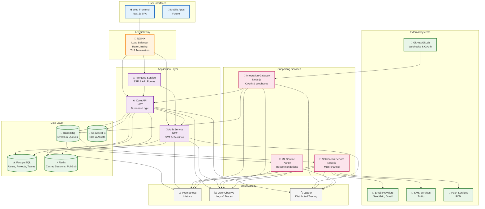
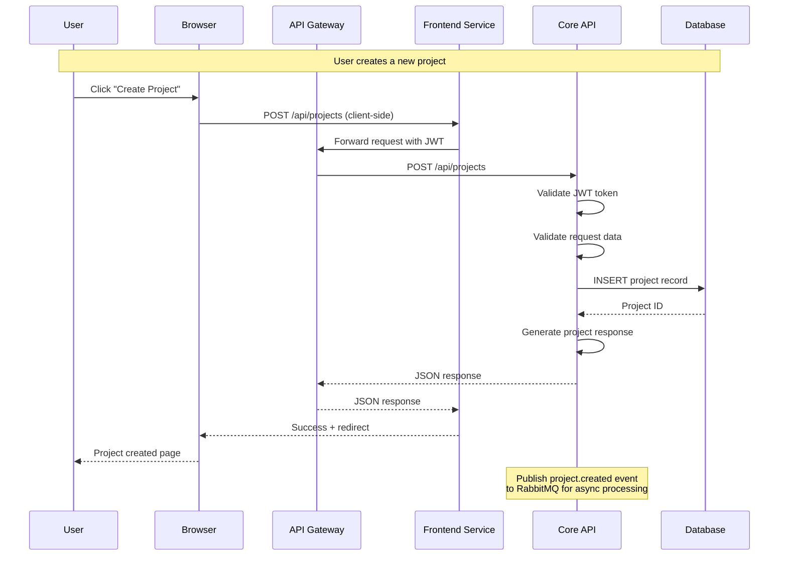
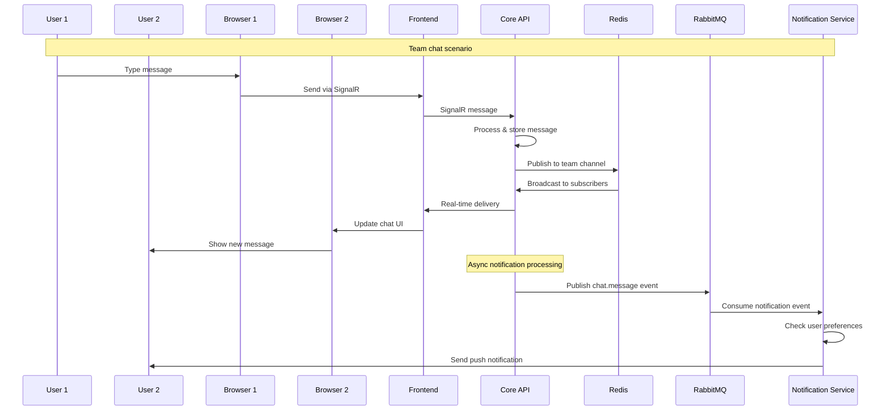
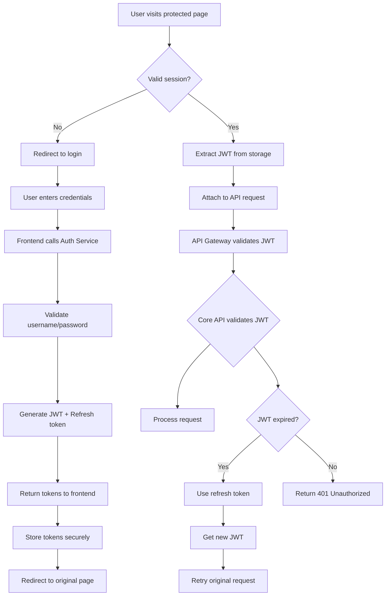
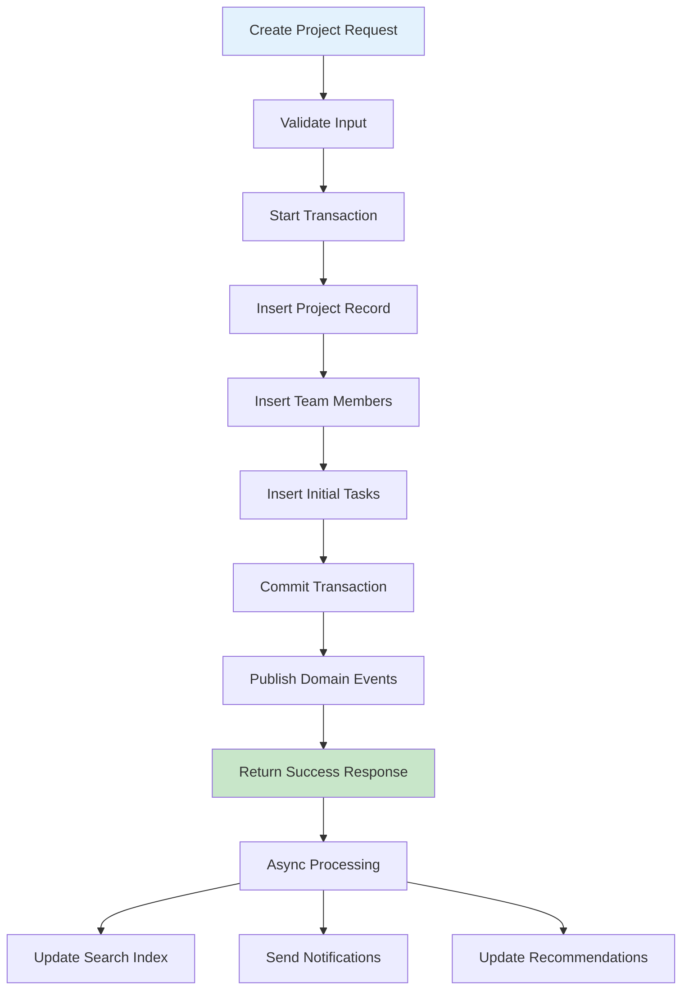
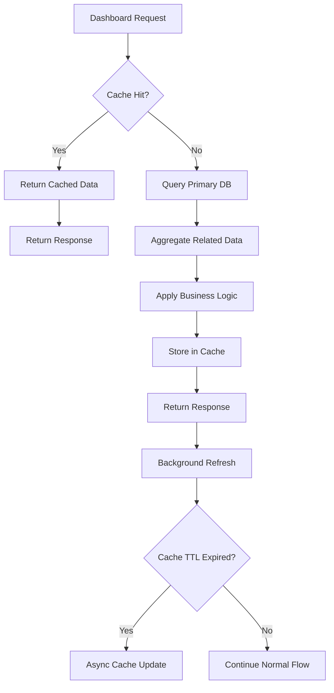
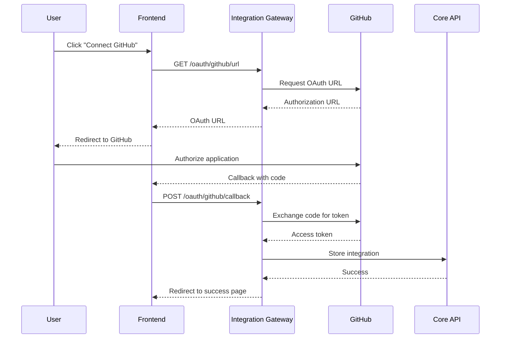
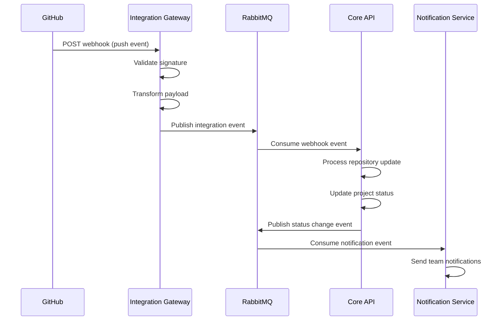
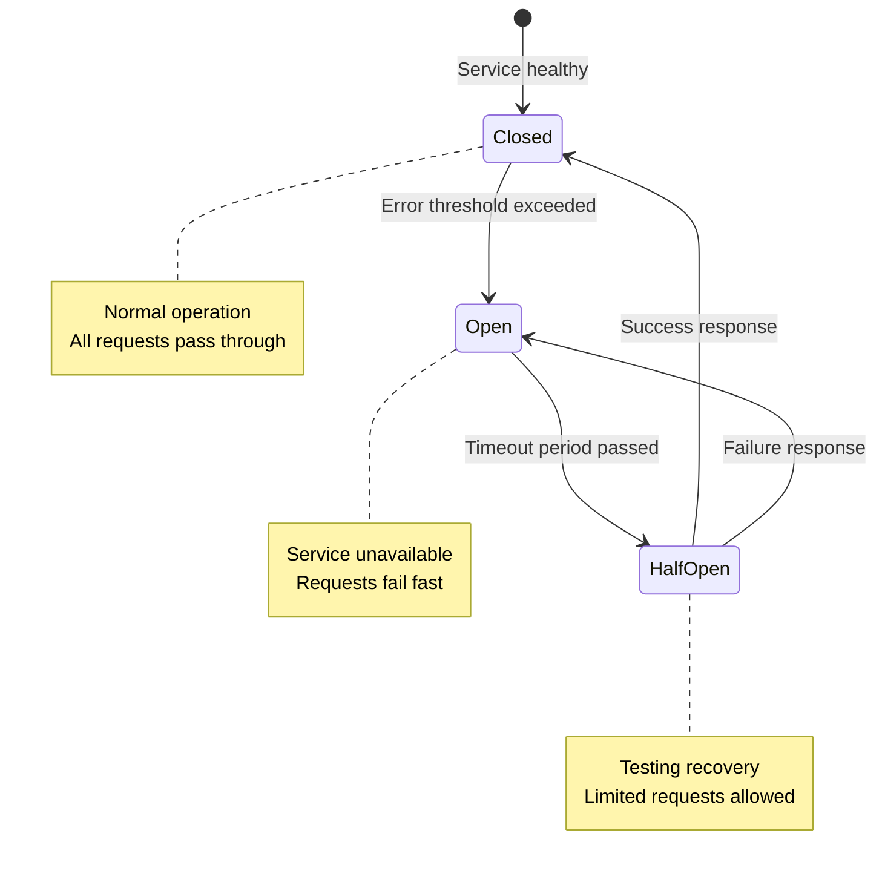
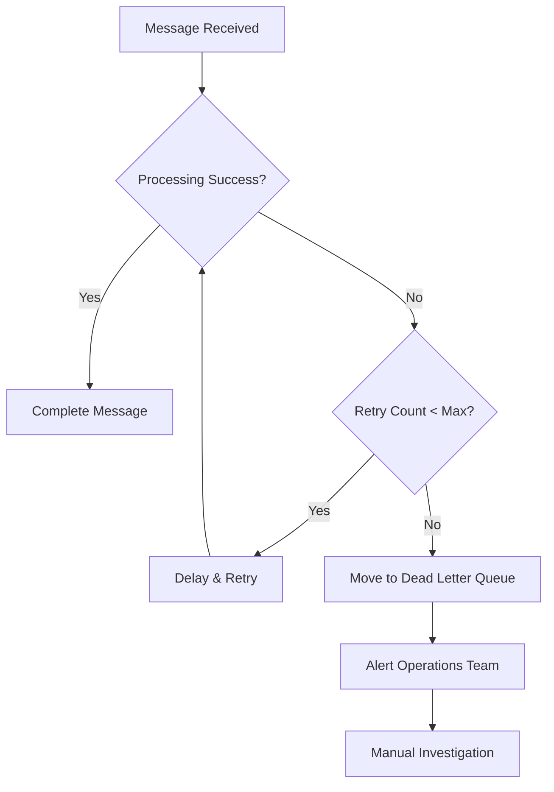

# Data Flow Diagrams

This document provides detailed visualizations of data flows, communication patterns, and interaction sequences within the DevHunt platform.

## System Architecture Overview



## Request Flow Patterns

### Synchronous API Call Flow



### Real-time Communication Flow



### Event-Driven Processing Flow

```mermaid
sequenceDiagram
    participant C as Core API
    participant RMQ as RabbitMQ
    participant IGW as Integration Gateway
    participant NS as Notification Service
    participant MS as ML Service
    participant DB as Database

    Note over C,DB: Project completion scenario

    C->>DB: Update project status to 'completed'
    C->>RMQ: Publish "project.completed" event
    RMQ->>NS: Consume for notifications
    NS->>NS: Generate completion email
    NS->>NS: Send to team members

    RMQ->>IGW: Consume for integrations
    IGW->>IGW: Check webhook configs
    IGW->>IGW: Send webhook to GitHub/GitLab

    RMQ->>MS: Consume for recommendations
    MS->>DB: Fetch project data
    MS->>MS: Update team success metrics
    MS->>DB: Store updated recommendations

    Note over NS,IGW,MS: All processing happens asynchronously<br/>without blocking the main API response
```

## Authentication & Authorization Flow



## Data Persistence Patterns

### Write Path (Project Creation)



### Read Path (Project Dashboard)



## Integration Patterns

### OAuth Flow (GitHub/GitLab)



### Webhook Processing Flow



## Error Handling & Resilience

### Circuit Breaker Pattern



### Retry & Dead Letter Queue Pattern



This comprehensive set of diagrams provides a complete view of how data flows through the DevHunt platform, from user interactions to background processing and external integrations.