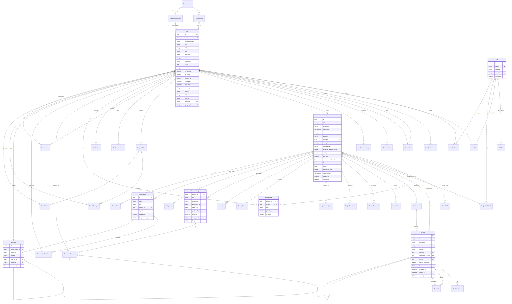

# Database Schema

This document provides a comprehensive view of DevHunt's PostgreSQL database schema, including entity relationships and key table structures.

## Entity Relationship Diagram

*Note: ER diagram based on DbContext relationships and model configurations. Some complex many-to-many relationships may be simplified for clarity.*



## Core Tables Overview

### Users Domain

| Table | Purpose | Key Relationships |
|-------|---------|-------------------|
| **Users** | Platform accounts with authentication and profiles | Owner of projects, member of teams, sender of messages |
| **RefreshTokens** | JWT refresh token storage | One-to-many with Users |
| **UserAchievements** | Gamification system | Many-to-many with Users and Achievements |
| **UserFollows** | Social following relationships | Self-referencing many-to-many |
| **UserPrivacySettings** | Privacy controls | One-to-one with Users |

### Projects Domain

| Table | Purpose | Key Relationships |
|-------|---------|-------------------|
| **Projects** | Main project entities | Owned by User, contains TeamMembers, Tasks, etc. |
| **TeamMembers** | Project membership (many-to-many) | Links Users to Projects with roles |
| **ProjectRoles** | Custom roles within projects | Defined per project |
| **ProjectTechStacks** | Technology associations | Links Projects to Skills |
| **Invitations** | Team join requests | Links Projects to Users |

### Task Management Domain

| Table | Purpose | Key Relationships |
|-------|---------|-------------------|
| **TaskItems** | Kanban-style tasks | Belong to Projects, assigned to Users, organized in Columns |
| **TaskColumns** | Kanban board columns | Contain Tasks within Projects |
| **TaskLinks** | Task dependencies | Self-referencing many-to-many on TaskItems |
| **TaskAttachments** | File attachments | Link Tasks to ProjectFiles |

### Communication Domain

| Table | Purpose | Key Relationships |
|-------|---------|-------------------|
| **Conversations** | Chat rooms and direct messages | Belong to Projects, contain Messages |
| **ConversationParticipants** | Users in conversations | Many-to-many between Users and Conversations |
| **Messages** | Chat messages | Belong to Conversations, sent by Users, can reply to other Messages |

### Content Management Domain

| Table | Purpose | Key Relationships |
|-------|---------|-------------------|
| **ProjectFiles** | File uploads with soft deletion | Belong to Projects, uploaded by Users |
| **ProjectDocuments** | Rich text documents | Belong to Projects, authored by Users |
| **ProjectNewsPosts** | News feed items | Belong to Projects, authored by Users |
| **ActivityRecords** | Audit trail | Generated by Projects and Users |

### Integration Domain

| Table | Purpose | Key Relationships |
|-------|---------|-------------------|
| **Integrations** | External service connections | Belong to Projects, one per service type |
| **Recommendations** | AI-generated suggestions | Link Users to Projects |
| **Skills** | Normalized skill taxonomy | Referenced by UserSkills and ProjectTechStacks |
| **SkillAliases** | Alternative skill names | Map to canonical Skills |

## Key Relationship Patterns

### One-to-Many Relationships
- **User → Projects** (ownership)
- **Project → Tasks** (containment)
- **Project → TeamMembers** (membership)
- **Conversation → Messages** (threading)
- **User → Messages** (authorship)

### Many-to-Many Relationships
- **Users ↔ Projects** via TeamMembers
- **Users ↔ Conversations** via ConversationParticipants
- **Users ↔ Users** via UserFollows (social following)
- **Tasks ↔ Tasks** via TaskLinks (dependencies)

### Self-Referencing Relationships
- **Messages → Messages** (reply threading)
- **ShowcaseComments → ShowcaseComments** (nested replies)
- **Tasks → Tasks** (dependency links)

### Polymorphic Relationships
- **ActivityRecords** can reference different entity types (Projects, Users, Tasks)
- **ModerationReports** can target different content types
- **Notifications** can link to various entities

## Data Flow Patterns

### User Registration Flow
```sql
-- 1. Create user account
INSERT INTO "Users" (id, email, password_hash, role, created_at)
VALUES ($1, $2, $3, 'participant', NOW());

-- 2. Initialize privacy settings
INSERT INTO "UserPrivacySettings" (user_id, profile_visibility, contact_visibility)
VALUES ($1, 'public', 'registered');
```

### Project Creation Flow
```sql
-- 1. Create project
INSERT INTO "Projects" (id, title, description, owner_id, status, visibility, created_at, updated_at)
VALUES ($1, $2, $3, $4, 'draft', 'private', NOW(), NOW());

-- 2. Add owner as team member
INSERT INTO "TeamMembers" (project_id, user_id, role, joined_at, is_active)
VALUES ($1, $4, 'owner', NOW(), true);

-- 3. Create default task board
INSERT INTO "TaskColumns" (id, project_id, title, position, created_at)
VALUES (gen_random_uuid(), $1, 'To Do', 0, NOW());
```

### Message Creation Flow
```sql
-- 1. Insert message
INSERT INTO "Messages" (id, conversation_id, sender_id, content, created_at)
VALUES ($1, $2, $3, $4, NOW());

-- 2. Update conversation last activity
UPDATE "Conversations"
SET last_message_at = NOW()
WHERE id = $2;

-- 3. Publish to outbox for notifications
INSERT INTO "OutboxEvents" (id, event_type, aggregate_id, payload, created_at)
VALUES (gen_random_uuid(), 'message.created', $1, $payload_json, NOW());
```

## Index Strategy

### Primary Performance Indexes (confirmed in DbContext)
- **Users**: `email` (unique), `github_id` (unique), `google_id` (unique)
- **Projects**: `(status, visibility, created_at)`, `(status, created_at)`, `difficulty_level`
- **Messages**: `(conversation_id, created_at)`, `(project_id, created_at)`
- **ActivityRecords**: `(visibility, created_at)`, `project_id`, `(actor_id, created_at)`, `event_type`

### Foreign Key Indexes
- EF Core automatically creates indexes for foreign keys
- Additional composite indexes for query optimization (confirmed in DbContext)

### Specialized Indexes (from DbContext configuration)
- **GIN indexes** on JSONB columns (ActivityRecords.PayloadJson, Integration.ConfigJson)
- **Array containment** support via PostgreSQL native functionality (TechStack arrays)
- **Partial indexes** for active records (GithubId/GoogledId when not null)

## Data Integrity Constraints

### Unique Constraints
- User emails must be unique across the platform
- GitHub/Google IDs must be unique when provided
- Team membership is unique per user-project pair
- Skill aliases must be unique
- Achievement codes must be unique

### Check Constraints
- User roles must be from predefined set
- Project status must follow state machine
- Task priority must be from allowed values
- Conversation types must be valid

### Referential Integrity
- Cascade deletes for dependent entities (messages when conversation deleted)
- Restrict deletes for referenced entities (prevent deleting users with active projects)
- Set null for optional relationships (unassigned tasks when user leaves)

This schema provides a solid foundation for DevHunt's complex domain model while maintaining performance and data consistency.