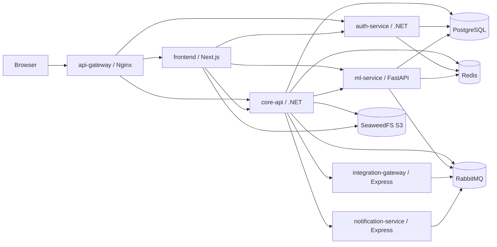

# High-Level Architecture

> _If any detail here contradicts the code, trust the code — not this page._

Use the generated [service topology](./generated/service-topology) for the current graph of services. This page explains the architectural meaning of that graph.

## Runtime Layers

## Synchronous Paths

Most user-facing requests are synchronous HTTP:

- Browser to Nginx to frontend for page rendering.
- Browser or frontend proxy to Auth Service for identity operations.
- Browser or frontend proxy to Core API for most business operations.
- Core API to ML Service for AI and recommendation use cases.
- Core API to integration-gateway for integration configuration and sync operations.
- Core API to notification-service for out-of-band delivery.

Controllers should stay thin. Core business behavior belongs in services, and database access is through EF Core-backed abstractions rather than raw SQL.

## Asynchronous Paths

Core API exposes `IEventBusService`, but the actual runtime behavior depends on configuration.

When RabbitMQ is configured and `Features:EventBus:Enabled` is true:

1. Business code awaits `IEventBusService.PublishAsync`.
2. `OutboxEventBusDecorator` writes an `OutboxEvents` row.
3. `OutboxEventProcessorWorker` polls pending rows every 5 seconds.
4. `RabbitMQEventBusService` publishes to topic exchange `devhunt.events`.
5. Consumer services process their queues.

When RabbitMQ is not configured or eventing is disabled, Core API registers `NoOpEventBusService`. In that mode, publishing does not throw, but no message and no outbox row are created.

Do not use fire-and-forget publishing. It bypasses the reliability expectations around awaited saves and the outbox.

## Persistence Model

Core API uses a scoped `DevHuntDbContext` connected to `ConnectionStrings:DefaultConnection`. A `ReadWriteDbContextFactory` exists and can create read or write contexts, but `CreateReadContext()` is not called anywhere at the verified commit. Most reads therefore hit the primary database.

`EnableDynamicJson()` is configured only through Core API's database extension. Auth Service has its own database setup and does not wire that Npgsql dynamic JSON behavior.

For schema orientation, use the generated [database ERD](./generated/database-erd) and the [glossary](../reference/glossary).

## Real-Time Layer

Core API hosts two SignalR hubs:

- `/chatHub` for conversation and project chat behavior.
- `/notificationHub` for per-user in-app notification delivery.

Redis backplane wiring is conditional. Without it, group membership and broadcasts are process-local, so clients connected to different Core API replicas do not all receive the same hub events.

See [Chat System](./chat-system) for hub-specific details.

## Edge And Security Layer

The Nginx gateway terminates TLS and adds baseline security headers. Auth Service and Core API both validate JWTs. Core API also runs CSRF token generation, global CSRF validation for mutating controller actions, rate limiting, active-user checks, and maintenance-mode checks.

Metrics endpoints are hand-guarded by private/loopback IP prefixes or `METRICS_TOKEN`, not a shared ASP.NET Core authorization policy.

See [Security](./security) for the current security model and caveats.

## Scale-Out Constraints

The verified code is single-instance-safe. Multi-replica Core API deployment needs explicit fixes or strict configuration:

| Risk                            | Why it matters                                                                          | Current fix direction                              |
| ------------------------------- | --------------------------------------------------------------------------------------- | -------------------------------------------------- |
| SignalR without Redis backplane | Broadcasts reach only clients on the same replica                                       | Enable Redis and `Features:Redis:Enabled=true`     |
| Rate limits without Redis       | Effective limit becomes number-of-replicas times the configured limit                   | Enable Redis-backed rate limit stores              |
| Outbox worker replicas          | `Processing` status is declared but not used; no row lock prevents duplicate publishing | Add DB-side locking or atomic status transition    |
| AI plan cancellation            | In-flight registry is process-local                                                     | Move registry to Redis or use sticky routing       |
| Maintenance mode                | `IMemoryCache` is per-process                                                           | Replace with distributed cache or invalidation     |
| Feature flags                   | invalidation clears local cache only                                                    | Move cache and invalidation to distributed storage |

Do not treat Kubernetes manifests as proof of multi-replica correctness. They show a deployment direction, not that shared-state hazards are solved.
